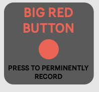
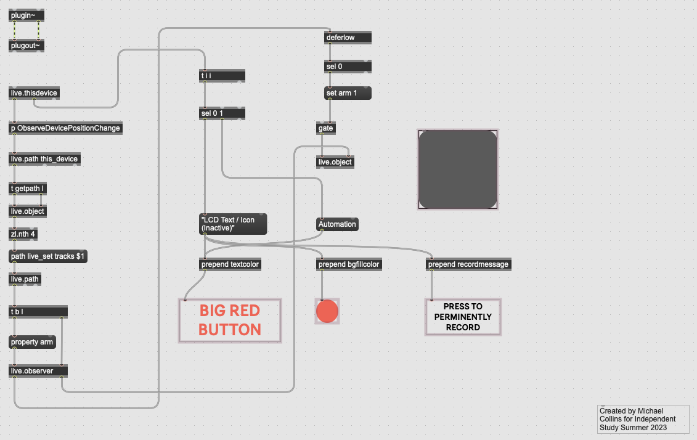

# theBigRedButton

## About this Project

The goal of this independent study project this summer was solve a problem that has plagued music producers and recording engineers alike for decades. The issue being the many missed opportunities that occur when the record button is not set to on and thus missing spontaneous moments of musical creativity. Keeping this in mind, I set out to solve this issue using Max/MSP by Cycling '74. The basic idea for this audio plugin was to create a small device that could sit within the effects rack of any studio session track and capture all the audio that was passing through the microphone or played through MIDI. Thus, the Big Red Button was born. 

Ideally, the Big Red Button's user interface would be a fast and simple workflow so that users could "set it and forget it".

-- (Screenshot of GUI) -- 

  

As the inital stages of development took place, there were several design choices that has to be made, the first of which being the manner in which the audio and MIDI could be recorded. Instead of opting for a more buffer-like storage system; it seemed more prudent to use the tools already at our disposal which in this case was the recording feature found in most modern digital audio workstations (DAW). In this case the digital audio workstations would handle all the storage of audio and MIDI for playback. This drasticly reduced the need for CPU space within a project and would also allow for this plugin to be smaller in size. In short this plugin essentially achieves its goal of easing the burden on music producers and recording engineers every time they record a new track by lessening the contstant thought of if they captured that spontaneous musical moment.

-- (Max/MSP Patch for the Big Red Button) --

## Key Features

- Real Time Audio/MIDI Capture: Recoding starts the moment the master record button in the digital audio workstation is pressed. This ensures that not a moment in the studio will be missed.
- Seamless Integration: Using the RNBO feature from Max/MSP, this max patch can be exported as a VST3 to whichever digital audio workstation of your choosing. It can also be exported into raw C++ source code as well.
- Visual Feedback: While the idea of this plugin is that you can "set it and forget it"; it is sometimes nice to have some visual feedback from the plugin as well. In this case the plugin will change color from its normal bright red to signify that it has stopped recording.

-- (Initial Design Diagram) --

